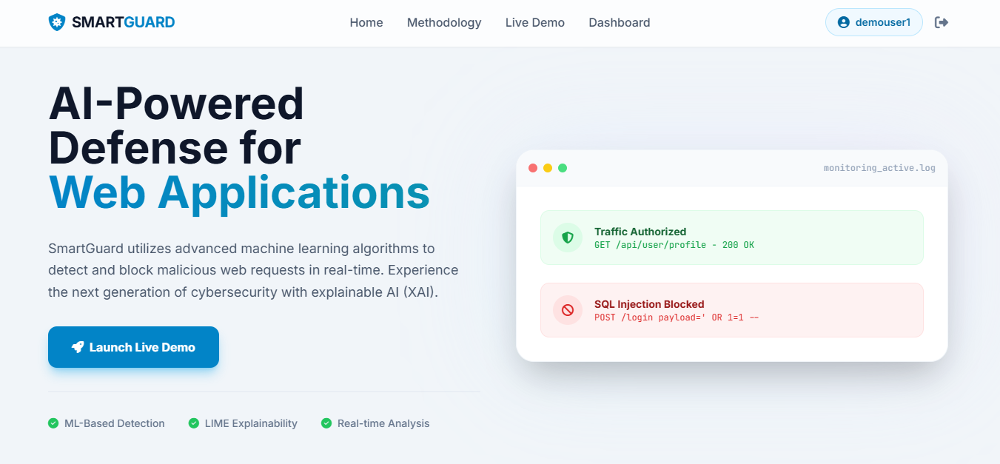
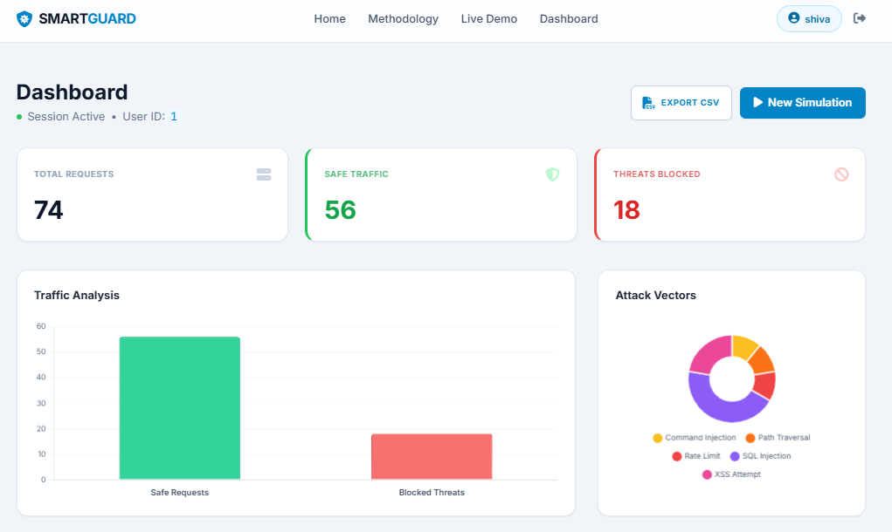
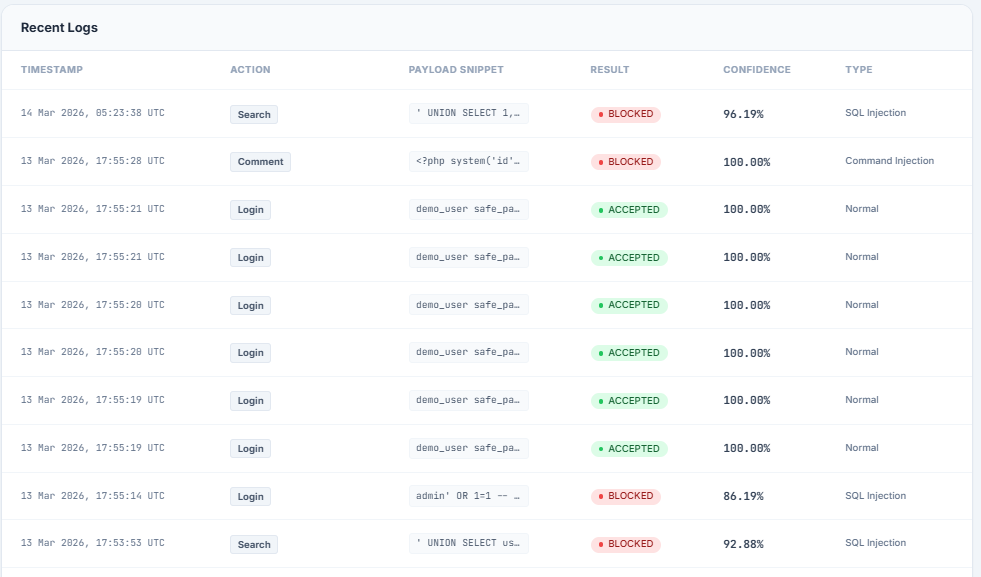

# SmartGuard: AI-Powered Web Application Firewall (Academic Major Project)

SmartGuard is an academic cyber-security demo that combines **Machine Learning (ML)** and **hybrid security logic** to inspect synthetic web requests and block malicious patterns in real time.

---

## Abstract

Modern web applications face attacks such as SQL Injection, XSS, path traversal, credential abuse, and automated bot traffic. Traditional static rule-only filters can miss evolving attack behavior, while pure ML systems can produce false positives for normal text traffic. SmartGuard proposes a hybrid Web Application Firewall simulator that combines ML confidence with edge-case security logic for safer, explainable decisions.

The system includes a live simulation interface, event-level analysis reports, user dashboards, and explainable features (LIME-style signal display). It is intended for academic demonstration, research presentation, and practical understanding of AI-assisted web security.

---

## Project Principle

1. **Detect fast, explain clearly**.
2. **Use ML + security rules together** rather than either alone.
3. **Reduce false positives** for clean natural text.
4. **Demonstrate end-to-end pipeline behavior** (Browser → Edge Node → Analysis → Enforcement → App Server).
5. **Keep everything local and academic-safe** (no real offensive functionality).

---

## Agenda / Goals

- Build a realistic interactive WAF simulator for demos.
- Demonstrate attack detection for common web attack families.
- Show explainability indicators to support model transparency.
- Visualize security events in a dashboard with logs and charts.
- Keep project reproducible for evaluators and faculty.

---

## Novelty / Contribution

- Hybrid decision engine: ML confidence + hard security signatures + false-positive override.
- Local test-extension style traffic driver integrated into same simulation UI.
- Full visual pipeline with detailed report panels.
- User-facing analytics dashboard with attack family breakdown.

---

## Proposed System

### High-Level Flow

1. Request is generated from Try Now forms or extension panel.
2. Feature extraction converts payload structure into model features.
3. ML model predicts malicious probability.
4. Hybrid logic applies safety checks and enforcement rules.
5. Final decision is logged and shown in dashboard/report view.

### Core Modules

- `app.py` → Flask backend, ML inference, hybrid decision logic, auth, logs.
- `templates/try_now.html` → simulation UI + extension popup + report.
- `templates/dashboard.html` → statistics, charts, historical logs.
- `static/js/main.js` → client fetch flow and result rendering.
- `static/js/dashboard.js` → chart rendering.

---

## Methodology

1. **Data/Model Layer**
   - Uses pre-trained artifacts in `models/`.
   - Features include SQL/XSS markers, payload complexity, request metadata proxies.

2. **Hybrid Inference Layer**
   - ML probability evaluates suspicious behavior.
   - Rule signatures catch high-confidence attack patterns.
   - Safety override reduces false positives for clean text input.

3. **Decision Layer**
   - Final output: `ACCEPTED` / `BLOCKED`.
   - Attack family labels are user-friendly (no internal implementation tags).

4. **Presentation Layer**
   - Real-time visual pipeline.
   - Threat impact report with key indicators.
   - Dashboard logging and attack distribution charts.

---

## Demo Screenshots

### Landing / Home


### Try Now / Simulation


### Logs and Monitoring


> You can add your latest screenshots in `demo_images/` and update these links as needed.

---

## Directory Structure (Full)

```text
.
├── app.py
├── requirements.txt
├── README.md
├── .gitignore
├── models/
│   ├── attack_classifier.pkl
│   ├── feature_extractor.pkl
│   └── lime_explainer.pkl
├── templates/
│   ├── base.html
│   ├── home.html
│   ├── about.html
│   ├── login.html
│   ├── profile.html
│   ├── try_now.html
│   └── dashboard.html
├── static/
│   ├── css/
│   │   └── style.css
│   └── js/
│       ├── main.js
│       └── dashboard.js
├── demo_images/
├── datasets/
├── DOCUMENTATION.md
├── smart_guard_setup_and_execution_guide.md
└── smart_guard_model_switching_guide.md
```

---

## Use Cases / Applications

- B.Tech / M.Tech cyber security major project demo.
- AI in cyber-security classroom lab demonstration.
- Explainable ML security prototype for seminars.
- Security awareness workshops for web attack patterns.

---

## Future Scope

- Adaptive thresholds per endpoint/user profile.
- Better calibration for confidence-to-risk mapping.
- More attack families (XXE, SSRF, deserialization).
- Role-based SOC-style dashboard views.
- Containerized deployment and CI test pipelines.

---

## How to Run (Any System)

## 1) Prerequisites

- Python 3.9+
- pip
- (Optional) Node.js only for JS syntax checks

Check versions:

```bash
python --version
pip --version
```

## 2) Clone and Setup

```bash
git clone <your-repo-url>
cd waf-2026-team9-major
python -m venv .venv
```

Activate virtual environment:

- Linux/macOS:
  ```bash
  source .venv/bin/activate
  ```
- Windows (PowerShell):
  ```powershell
  .venv\Scripts\Activate.ps1
  ```

Install dependencies:

```bash
pip install -r requirements.txt
```

## 3) Verify required model artifacts

Ensure these files exist:

- `models/attack_classifier.pkl`
- `models/feature_extractor.pkl`
- `models/lime_explainer.pkl`

## 4) Run application

```bash
python app.py
```

Open:

```text
http://localhost:5000
```

---

## Database Operations (SQLite)

The app uses `smartguard.db` in project root.

## Use existing DB

- Place your DB file in root as `smartguard.db`.
- Run app normally.

## Initialize/refresh DB schema

When app starts, it ensures required tables/columns exist.

## Clear DB manually

```bash
python - <<'PY'
import sqlite3
conn=sqlite3.connect('smartguard.db')
cur=conn.cursor()
cur.execute('DELETE FROM logs')
cur.execute('DELETE FROM users')
conn.commit()
conn.close()
print('Cleared users/logs')
PY
```

## View tables and records

```bash
python - <<'PY'
import sqlite3
conn=sqlite3.connect('smartguard.db')
cur=conn.cursor()
print('Tables:')
for row in cur.execute("SELECT name FROM sqlite_master WHERE type='table'"):
    print(' -', row[0])
print('\nUsers count:', cur.execute('SELECT COUNT(*) FROM users').fetchone()[0])
print('Logs count:', cur.execute('SELECT COUNT(*) FROM logs').fetchone()[0])
conn.close()
PY
```

---

## How to Run in GitHub Codespaces

1. Open repo in Codespaces.
2. In terminal:
   ```bash
   python -m venv .venv
   source .venv/bin/activate
   pip install -r requirements.txt
   python app.py
   ```
3. Codespaces will show forwarded port `5000`.
4. Open the forwarded URL in browser.

---

## Recommended Quick Validation

```bash
python -m py_compile app.py
node --check static/js/main.js static/js/dashboard.js
```

API smoke test:

```bash
python - <<'PY'
from app import app, init_db
init_db()
with app.test_client() as c:
    print('home', c.get('/').status_code)
    print('try_now', c.get('/try_now').status_code)
    print('analyze', c.post('/analyze', json={'payload':'hello', 'action_type':'Comment'}).status_code)
PY
```

---

## Disclaimer

SmartGuard is an **academic simulation project**. It is not a production security product and should not be used as a sole defense layer in live systems.
